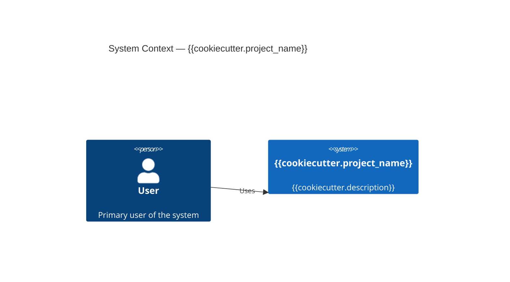

# Architecture — {{cookiecutter.project_name}}

> Under 200 lines. Updated rarely. Read this before making structural changes.

## System Overview



## Module Hierarchy

```
src/{{cookiecutter.package_name}}/
└── __init__.py    # Public API exports
```

_Add one paragraph per module as the project grows._

## Data Flow

_Describe how data moves through the system._

## Conventions

- **Types:** Dataclasses for internal state. TypedDict for external dict-shaped data. Pydantic for validated input at system boundaries.
- **Errors:** Explicit return types or exceptions at boundaries. No silent failures.
- **Testing:** Unit tests for pure functions. Integration tests at system boundaries.

## Boundaries

_What this system is responsible for, and what it explicitly is not._
