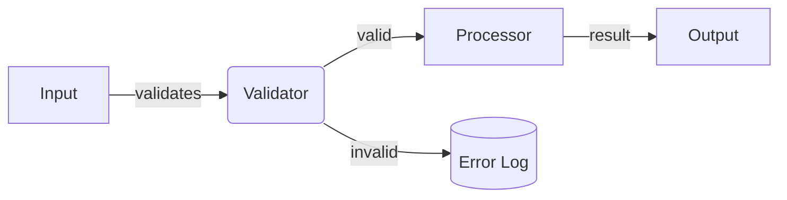

# Mermaid Style Guide — {{cookiecutter.project_name}}

Conventions for diagrams in this project. Consistent encoding reduces cognitive load.

---

## Diagram Types by Use Case

| Use case | Diagram type |
|----------|-------------|
| System context (C4 L1) | `C4Context` |
| Container view (C4 L2) | `C4Container` |
| Data flow | `graph LR` or `graph TD` |
| Sequence / interactions | `sequenceDiagram` |
| State machines | `stateDiagram-v2` |

---

## Visual Encoding Conventions

### Graph direction
- **Left-to-right (`LR`)**: data flow, pipelines, transformations
- **Top-to-down (`TD`)**: hierarchies, call stacks, module dependencies

### Node shapes
- `[Rectangle]` — system component, module
- `(Rounded)` — process, operation
- `{Diamond}` — decision point
- `[(Database)]` — persistent store
- `((Circle))` — external actor or event

### Edge labels
- Always label edges that carry data or have conditions
- Keep labels under 5 words

---

## Example

---

## Notes

_Update this guide when a new encoding convention is established._
