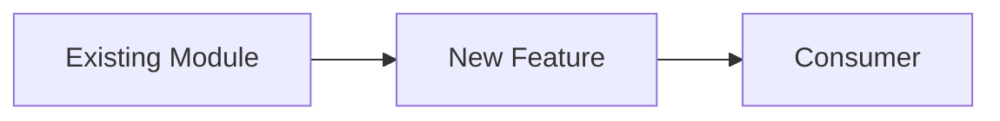

# Story: {Title}

## Why

{What problem does this solve? For whom? Why now?}

## Mental Model

{How does this fit into the existing system? Show relationships, not just the new thing.}

## Acceptance Criteria (failing-to-passing checklist)

- [ ] {Criterion 1 — verifiable without reading the code}
- [ ] {Criterion 2}
- [ ] {Criterion 3}

## Interfaces Changed

{Which module interfaces are affected? List new types, modified signatures, removed exports.}

| Interface | Change | Reason |
|-----------|--------|--------|
| | | |

## Notes

{Constraints, edge cases, open questions resolved during planning.
Record decisions here so future agents don't re-litigate them.}
